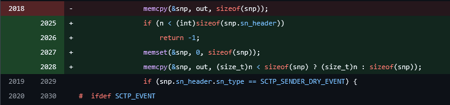
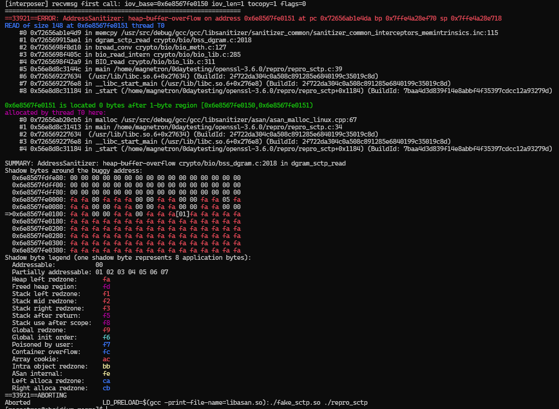

# openssl-heap-oob-sctp

OpenSSL SCTP BIO Notification Heap OOB Read in `dgram_sctp_read`.

> **Status:** Reported previously. While this is a confirmed vulnerability, it is highly unlikely to be exploited, and the overall impact is low. 
> *Note: This is fixed in the `main` branch on GitHub, but the releases do not yet include this patch.*


## Vulnerability Details

The vulnerability exists in the SCTP BIO implementation (`crypto/bio/bss_dgram.c`) and results in a heap out-of-bounds read. This issue allows an application to read uninitialized or out-of-bounds memory when processing a truncated SCTP notification, leading to potential Denial of Service (DoS) or undefined behavior.

- **Component:** `crypto/bio/bss_dgram.c`
- **Function:** `dgram_sctp_read`
- **Issue Type:** `heap-buffer-overflow` (read) / [CWE-126](https://cwe.mitre.org/data/definitions/126.html)
- **Impact:** Denial of Service (Application crash via ASan/Segfault)

## Technical Analysis

In `dgram_sctp_read`, when `recvmsg` returns with the `MSG_NOTIFICATION` flag set, the code assumes the received data length is at least `sizeof(union sctp_notification)`. It blindly copies the buffer into a local stack union without verifying the actual number of bytes read.

If an application calls `BIO_read` with a small buffer (e.g., 1 byte), `recvmsg` respects this limit and returns 1 byte. However, the subsequent `memcpy` attempts to read the full size of the union (approx. 132 bytes) from the user-provided buffer, causing an out-of-bounds read.

## Reproduction

1. **Build Environment:**
   Download the OpenSSL 3.6.0 release and configure with ASAN and SCTP:
   ```bash
   ./config enable-sctp enable-asan -d
   make -j$(nproc)
   ```

2. **Prepare PoC:**
   Create the directory for the PoCs inside the openssl folder:
   ```bash
   mkdir repro
   cd repro
   # Download the PoC files and place them into the 'repro' folder.
   ```

3. **Compile:**
   Compile the interposer and the test binary:
   ```bash
   # Compile the interposer
   gcc -shared -fPIC -o fake_sctp.so fake_sctp.c -ldl

   # Compile the test binary
   gcc -fsanitize=address -g -o repro_sctp repro_sctp.c -I../include -L.. -lssl -lcrypto
   ```

4. **Run:**
   Set the environment variables and execute:
   ```bash
   export LD_LIBRARY_PATH=..
   export ASAN_OPTIONS=abort_on_error=1
   
   LD_PRELOAD=$(gcc -print-file-name=libasan.so):./fake_sctp.so ./repro_sctp
   ```

   
